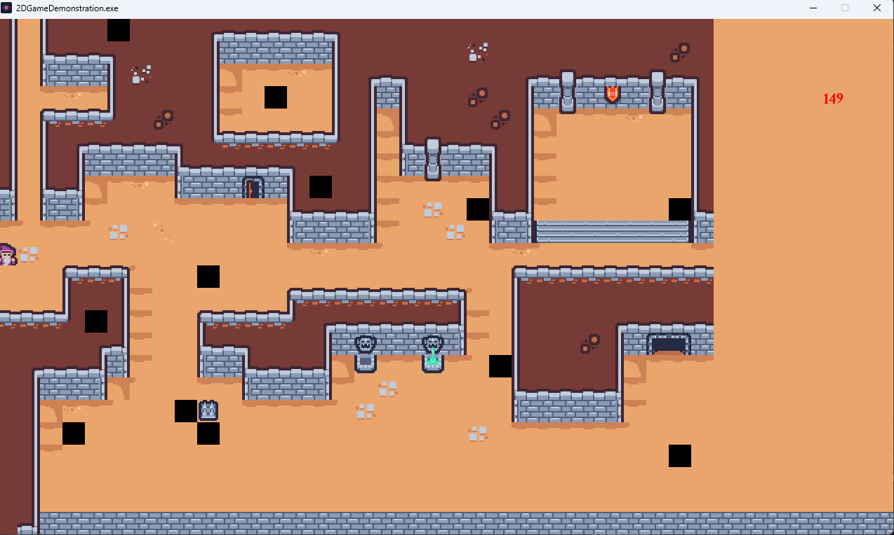
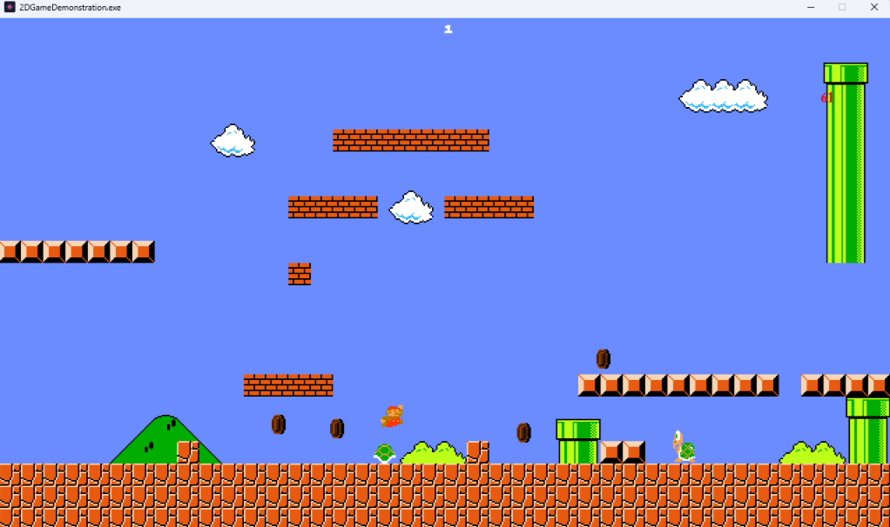

# ValyrianEngine: 2D Platformer Framework

[](https://opensource.org/licenses/MIT)
[](https://en.wikipedia.org/wiki/C%2B%2B17)
[](https://liballeg.org/)

A high-performance 2D platformer framework and reusable game engine built from the ground up in C++17. 

This project is a demonstration of a modular game engine architecture, featuring custom animation systems, grid-based collision detection, and a flexible resource management layer.

---

## Supported / Created games

* Mario - With some very basic interactions and animations
* Simple fun dungeon map - just tile map

To switch between maps, open `src/GameManager.cpp` and change the assignment near the bottom of `GameManager::main()`:

```cpp
// Switch active level here:
m_currentMapConfig = marioMapConfig;    // classic Mario level
// m_currentMapConfig = dungeonMapConfig;  // top-down dungeon
```

Anyone is welcome to add a simple menu selection.

## 🎮 Features

### Core Gameplay
- **Authentic Physics**: Classic platformer walking, running, and jump-arc physics.
- **Power-up System**: Smooth state transitions between different character states and abilities.
- **Classic Entities**: Diverse enemy AI behaviors and interactive world objects.
- **World Interaction**: Breakable elements, collectible items, and environmental triggers.
- **Level Design**: Fully supports tile-based levels authored in [Tiled](https://www.mapeditor.org/).

### Technical Highlights (The "Engine" Layer)
- **Modular Animator System**: Composable animators (`FrameRange`, `Moving`, `Flash`) that can be layered for complex behaviors.
- **Resource Management**: Flyweight pattern for animation films and singletons for bitmaps/sounds to minimize memory footprint.
- **Late Destruction Pattern**: Ensures pointer safety by deferring object deletion to the end of the frame.
- **Spatial Grid Collision**: Optimized collision detection using a logical grid rather than brute-force N^2 checks.
- **Cross-Platform**: Built using CMake and vcpkg for seamless setup on Windows and Linux.

---

## 📸 Screenshots

| Dungeon Map | Classic Map |
|:---:|:---:|
|  |  |

---

## 🛠️ Built With

- **Language**: C++17
- **Graphics & Audio**: [Allegro 5](https://liballeg.org/)
- **Map Parsing**: [tmxlite](https://github.com/fallahn/tmxlite)
- **Logging**: [spdlog](https://github.com/gabime/spdlog)
- **Package Manager**: [vcpkg](https://github.com/microsoft/vcpkg)
- **Build System**: CMake 3.21+

---

## 🚀 Getting Started

### Prerequisites
- **Windows** or **Linux**
- **CMake 3.21+**
- **vcpkg** (with `VCPKG_ROOT` environment variable set)

### 1. Install Dependencies
```bash
# Clone vcpkg if you haven't already
git clone https://github.com/microsoft/vcpkg
./vcpkg/bootstrap-vcpkg.sh # .bat on Windows

# Install required libraries
vcpkg install allegro5 tmxlite spdlog zstd pugixml
```

### 2. Build
This project uses CMake Presets for a "one-click" configuration.

**Windows:**
```powershell
cmake --preset dev-windows
cmake --build --preset dev-windows-debug
```

**Linux:**
```bash
cmake --preset dev-linux
cmake --build --preset dev-linux-debug
```

### 3. Run
Execute the binary from the project root:
```bash
./build/windows/2DGameDemonstration.exe # Windows
./build/linux/2DGameDemonstration       # Linux
```

---

## ⌨️ Controls

| Key | Action |
|---|---|
| **A/D** | Move |
| **Space** | Jump - Per game config |
| **Left Shift** | Run - Jump - Per game config |
| **Enter** | Start Game |
| **Escape** | Quit |

---

## 🏗️ Architecture Overview

The codebase is split into two distinct layers to maximize reusability:

1.  **`Engine/`**: A static library containing the core framework. It handles the windowing, event loop, rendering backends (Allegro 5), and the sprite/animator ecosystem. It is entirely game-agnostic.
2.  **`src/`**: The game-specific logic. This layer implements specific player, enemy, and world-interaction logic by extending and composing engine primitives.

Detailed documentation can be found in the [docs/](docs/) folder.

---

## 📝 License

Distributed under the MIT License. See `LICENSE` for more information.

---

## ⭐ Support the Project

If you find this project interesting, please consider giving it a star! It helps more people discover the engine.

---

## ⚠️ Known Limitations

- Only one tile layer is currently rendered — this causes black boxes in the dungeon map.
- The Mario level has no win/end condition yet.
- There is no death animation for Mario.
- Scalling is mess. Design idea was to enable scalling for the tile layer or not so game can be more zoomed. Now everything is messed up and only work at x2 scalling